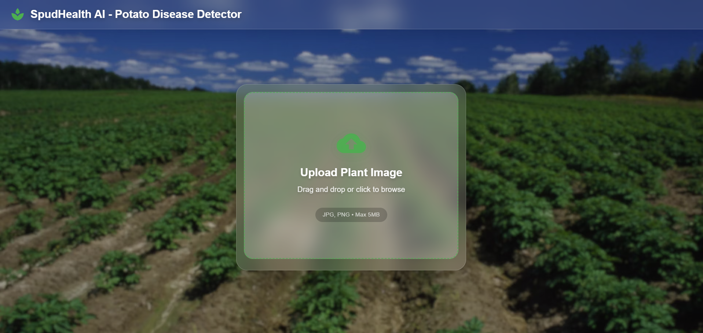

# 🥔SpudHealth AI - Potato Disease Classification

> AI-powered web application for detecting Early Blight, Late Blight, and Healthy potato leaves with **98.82% accuracy**

[](https://www.python.org/)
[](https://www.tensorflow.org/)
[](https://fastapi.tiangolo.com/)
[](https://reactjs.org/)
[](LICENSE)

---

## 📋 Table of Contents
- [Overview](#-overview)
- [Features](#-features)
- [Demo](#-demo)
- [Project Structure](#-project-structure)
- [Prerequisites](#-prerequisites)
- [Installation](#-installation)
  - [Backend Setup - Two Approaches](#backend-setup---choose-your-approach)
  - [Frontend Setup](#frontend-setup)
- [Usage](#-usage)
- [Model Information](#-model-information)
- [API Documentation](#-api-documentation)
- [Training Your Own Model](#-training-your-own-model)
- [Deployment](#-deployment)
- [Contributing](#-contributing)
- [License](#-license)
- [Author](#-author)

---

## 🌟 Overview

This project provides an end-to-end solution for detecting potato plant diseases using deep learning. It classifies potato leaf images into three categories:

- **Early Blight** - Fungal disease causing dark spots on leaves
- **Late Blight** - Serious disease causing leaf decay
- **Healthy** - No disease detected

The system includes a beautiful, responsive web interface built with React and Material-UI, with a powerful backend powered by FastAPI and TensorFlow.

---

## ✨ Features

- 🎯 **High Accuracy**: 98.82% classification accuracy
- 🚀 **Two Backend Options**: Simple FastAPI or Production-grade TF Serving
- 🎨 **Modern UI**: Beautiful glassmorphism design with responsive layout
- 📱 **Mobile-Friendly**: Works seamlessly on all devices
- ⚡ **Fast Predictions**: Real-time disease detection
- 🔒 **Robust**: Built with industry-standard practices
- 📊 **Confidence Scores**: Get prediction confidence for each result
- 🎓 **Trainable**: Included Jupyter notebook to train your own model

---

## 🎬 Demo



*Upload a potato leaf image and get instant disease classification*

---

## 📁 Project Structure

```
potato-disease-classification/
├── api/
│   ├── main.py                                    # Simple FastAPI backend
│   ├── tf-serving-main.py                         # FastAPI + TF Serving backend
│   ├── generate-tf-serving-compatible-models.py   # Convert model for TF Serving
│   └── requirements.txt                           # Backend dependencies
├── frontend/
│   ├── src/
│   │   ├── home.js                                # Main UI component
│   │   ├── App.js
│   │   ├── index.js
│   │   ├── reportWebVitals.js
│   │   ├── index.css
│   │   ├── cblogo.PNG
│   │   └── bg.png
│   ├── public/
│   ├── package.json
│   ├── package-lock.json
│   └── .env.example                               # Environment config template
├── training/
│   ├── potato-disease-classification-collab.ipynb # Training notebook
│   └── PlantVillage/                              # Dataset (after download)
├── saved_models/
│   └── 1.keras                                    # Trained model (download required)
├── tf_serving_models/                             # Auto-generated for TF Serving
│   └── potatoes_model/
│       └── 1/
├── test_images_from_internet/                     # Sample test images
│   ├── early_blight_test.jpg
│   └── healthy_test.jpg
├── requirements_all.txt                           # All Python dependencies
├── .gitignore
└── README.md
```

---

## 🔧 Prerequisites

Before you begin, ensure you have the following installed:

### Required Software
- **Python 3.8+** - [Download](https://www.python.org/downloads/)
- **Node.js 14+** and **npm** - [Download](https://nodejs.org/)
- **Git** - [Download](https://git-scm.com/)

### Optional (for TF Serving approach)
- **Docker Desktop** - [Download](https://www.docker.com/products/docker-desktop/)

---

## 🚀 Installation

### 1️⃣ Clone the Repository

```bash
git clone https://github.com/AnshulDev-100/potato-disease-classification.git
cd potato-disease-classification
```

### 2️⃣ Download Pre-trained Model

Download the trained model (98.82% accuracy) from Google Drive:

**[📥 Download Model (1.keras)](https://drive.google.com/drive/folders/1n9UzCfAbEtT36Qdvci9zROtkX5PAyG2d?usp=sharing)**

After downloading, place it in the correct location:

```bash
# Place the downloaded file here:
potato-disease-classification/saved_models/1.keras
```

Your `saved_models` folder should look like:
```
saved_models/
└── 1.keras  ← Place downloaded model here
```

---

## 🔥 Backend Setup - Choose Your Approach

You have **two options** for running the backend. Choose based on your needs:

| Approach | Best For | Complexity | Production-Ready |
|----------|----------|------------|------------------|
| **Approach 1** | Learning, Testing, Quick Setup | ⭐ Easy | ❌ No |
| **Approach 2** | Deployment, Scalability, Industry Standard | ⭐⭐⭐ Advanced | ✅ Yes |

---

### 🟢 Approach 1: Simple FastAPI Backend (Recommended for Beginners)

**Perfect for**: Quick testing, development, learning

#### Step 1: Create Virtual Environment

```bash
# Create virtual environment
python -m venv venv

# Activate virtual environment
# On Windows:
venv\Scripts\activate

# On Mac/Linux:
source venv/bin/activate
```

#### Step 2: Install Dependencies

```bash
# Install all required packages
pip install -r requirements_all.txt
```

#### Step 3: Verify Model Location

Ensure your model is at: `saved_models/1.keras`

#### Step 4: Start Backend Server

```bash
cd api
python main.py
```

✅ Backend will start at: **http://127.0.0.1:4000**

#### Step 5: Test Backend

Open a new terminal and test:

```bash
curl http://127.0.0.1:4000/ping
# Should return: "Hello, I am alive"
```

**✨ That's it! Simple backend is ready. Skip to [Frontend Setup](#frontend-setup)**

---

### 🔵 Approach 2: FastAPI + TensorFlow Serving (Production-Grade)

**Perfect for**: Deployment, high performance, industry standards

This approach separates the model serving from the API layer, making it more scalable and production-ready.

#### Step 1: Create Virtual Environment

```bash
# Create virtual environment
python -m venv venv

# Activate virtual environment
# On Windows:
venv\Scripts\activate

# On Mac/Linux:
source venv/bin/activate
```

#### Step 2: Install Dependencies

```bash
# Install all required packages
pip install -r requirements_all.txt
```

#### Step 3: Convert Model for TF Serving

TensorFlow Serving requires models in SavedModel format. Convert your Keras model:

```bash
# From project root directory
python api/generate-tf-serving-compatible-models.py
```

✅ This creates: `tf_serving_models/potatoes_model/1/`

**Expected Output:**
```
Loading model from: saved_models/1.keras
✅ TF Serving model exported successfully
   Model name : potatoes_model
   Version    : 1
   Location   : tf_serving_models/potatoes_model/1
```

#### Step 4: Install and Start Docker

1. **Install Docker Desktop** (if not already installed)
   - Windows/Mac: [Download Docker Desktop](https://www.docker.com/products/docker-desktop/)
   - Verify installation: `docker --version`

2. **Start Docker Desktop** application

#### Step 5: Run TensorFlow Serving Container

```bash
# For Windows PowerShell (from project root):
docker run -d -p 8501:8501 `
  -v "${PWD}/tf_serving_models:/models" `
  -e MODEL_NAME=potatoes_model `
  --name tf_serving `
  tensorflow/serving

# For Mac/Linux (from project root):
docker run -d -p 8501:8501 \
  -v "$(pwd)/tf_serving_models:/models" \
  -e MODEL_NAME=potatoes_model \
  --name tf_serving \
  tensorflow/serving
```

**Flags Explained:**
- `-d`: Run in detached mode (background)
- `-p 8501:8501`: Expose TF Serving port
- `-v`: Mount your models directory
- `-e MODEL_NAME`: Set model name
- `--name`: Container name for easy management

#### Step 6: Verify TF Serving is Running

```bash
# Check container status
docker ps

# Test TF Serving endpoint
curl http://localhost:8501/v1/models/potatoes_model
```

✅ Should return model metadata if working correctly

#### Step 7: Start FastAPI Backend

Open a **new terminal** (keep TF Serving running):

```bash
# Activate virtual environment
# Windows:
venv\Scripts\activate
# Mac/Linux:
source venv/bin/activate

# Start FastAPI backend
cd api
python tf-serving-main.py
```

✅ Backend will start at: **http://127.0.0.1:8002**

#### Step 8: Test the Complete Setup

```bash
# Test API health
curl http://127.0.0.1:8002/ping
# Should return: {"status": "alive"}

# Test root endpoint
curl http://127.0.0.1:8002/
# Should return: {"message": "Potato Disease Classifier API"}
```

#### 🛑 Stopping TF Serving

When you're done:

```bash
# Stop the container
docker stop tf_serving

# Remove the container (optional)
docker rm tf_serving

# Restart later
docker start tf_serving
```

**✨ Production backend is ready! Continue to [Frontend Setup](#frontend-setup)**

---

## 🎨 Frontend Setup

### Step 1: Navigate to Frontend Directory

```bash
cd frontend
```

### Step 2: Install Dependencies

```bash
npm install
```

**Note:** You may see deprecation warnings. This is normal and safe to ignore. The app works perfectly with these dependencies.

### Step 3: Configure Environment Variables

```bash
# Copy the example env file
cp .env.example .env
```

Edit the `.env` file based on your backend choice:

**For Approach 1 (Simple Backend):**
```env
REACT_APP_API_URL=http://127.0.0.1:4000/predict
```

**For Approach 2 (TF Serving Backend):**
```env
REACT_APP_API_URL=http://127.0.0.1:8002/predict
```

### Step 4: Start Frontend Development Server

```bash
npm start
```

✅ Frontend will automatically open at: **http://localhost:3000**

---
## ⚠️ Node.js v17+ Compatibility Issue

If you encounter an error like `ERR_OSSL_EVP_UNSUPPORTED` or `digital envelope routines::unsupported` when running `npm start`, this is due to OpenSSL 3 changes in Node.js v17+.

### Quick Fix

**Temporary (Current Session Only):**
```bash
# Windows PowerShell
$env:NODE_OPTIONS="--openssl-legacy-provider"
npm start

# Mac/Linux
export NODE_OPTIONS="--openssl-legacy-provider"
npm start
```

**Permanent Fix:**
```bash
# Windows PowerShell (Run as Administrator)
setx NODE_OPTIONS "--openssl-legacy-provider"
# Close terminal and open new one
npm start

# Mac/Linux (Add to ~/.bashrc or ~/.zshrc)
echo 'export NODE_OPTIONS="--openssl-legacy-provider"' >> ~/.bashrc
source ~/.bashrc
npm start
```

**Alternative:** Downgrade to Node.js v16 LTS for full compatibility.

## 🎯 Usage

### Quick Start Guide

1. **Ensure Backend is Running**
   - Approach 1: `python api/main.py` (port 4000)
   - Approach 2: Docker + `python api/tf-serving-main.py` (port 8002)

2. **Ensure Frontend is Running**
   - `npm start` in frontend folder (port 3000)

3. **Open Browser**
   - Navigate to: http://localhost:3000

4. **Upload Image**
   - Drag and drop a potato leaf image
   - Or click to browse and select

5. **Get Results**
   - Disease classification (Early Blight / Late Blight / Healthy)
   - Confidence score (%)

### Testing with Sample Images

Use the provided test images in `test_images_from_internet/`:

```bash
# Try these sample images in the web interface:
test_images_from_internet/early_blight_test.jpg
test_images_from_internet/healthy_test.jpg
```

---

## 🧠 Model Information

### Architecture
- **Framework**: TensorFlow 2.16.2 / Keras
- **Type**: Convolutional Neural Network (CNN)
- **Input Shape**: 256x256x3 (RGB images)
- **Output**: 3 classes (Early Blight, Late Blight, Healthy)

### Performance
- **Accuracy**: 98.82%
- **Dataset**: PlantVillage
- **Training Images**: ~2,000+ images
- **Validation Split**: 80-20

### Key Features
- ✅ Data Augmentation (rotation, flip, zoom)
- ✅ TensorFlow Data Pipeline (prefetch, cache)
- ✅ Batch Normalization
- ✅ Dropout for regularization
- ✅ Early Stopping

### Classes
1. **Early Blight** - Fungal infection (Alternaria solani)
2. **Late Blight** - Oomycete infection (Phytophthora infestans)
3. **Healthy** - No disease symptoms

---

## 📚 API Documentation

### Base URLs

- **Simple Backend**: `http://127.0.0.1:4000`
- **TF Serving Backend**: `http://127.0.0.1:8002`

### Endpoints

#### 1. Health Check
```http
GET /ping
```

**Response:**
```json
{
  "status": "alive"
}
```

---

#### 2. Root Endpoint
```http
GET /
```

**Response:**
```json
{
  "message": "Potato Disease Classifier API"
}
```

---

#### 3. Predict Disease
```http
POST /predict
```

**Request:**
- **Content-Type**: `multipart/form-data`
- **Body**: 
  - `file`: Image file (JPG, PNG)

**Example using cURL:**
```bash
curl -X POST \
  http://127.0.0.1:4000/predict \
  -F "file=@/path/to/potato_leaf.jpg"
```

**Example using Python:**
```python
import requests

url = "http://127.0.0.1:4000/predict"
files = {"file": open("potato_leaf.jpg", "rb")}
response = requests.post(url, files=files)

print(response.json())
```

**Success Response:**
```json
{
  "class": "Early Blight",
  "confidence": 0.9823
}
```

**Error Response:**
```json
{
  "error": "Invalid image format"
}
```

---

## 🎓 Training Your Own Model

Want to train a custom model with your own data or improved architecture?

### Option 1: Use the Provided Notebook (Recommended)

#### Step 1: Download Dataset

Download the PlantVillage dataset from Kaggle:

**[📥 Download Dataset](https://www.kaggle.com/arjuntejaswi/plant-village)**

Extract to: `training/PlantVillage/`

#### Step 2: Open Training Notebook

The complete training notebook is available at:
```
training/potato-disease-classification-collab.ipynb
```

**Or access directly**: [View Notebook on Google Drive](https://drive.google.com/file/d/1w73Bgyjo--cMfCgtp2FAo7Cq7Bg5gLlU/view?usp=drive_link)

#### Step 3: Run on Google Colab

1. Upload notebook to [Google Colab](https://colab.research.google.com/)
2. Upload dataset or mount Google Drive
3. Run all cells
4. Download trained model

#### Step 4: Use Your Trained Model

After training, save your model:

```python
# In notebook
model.save('my_potato_model.keras')
```

Download and place in: `saved_models/1.keras`

### Training Features Included

The notebook includes:
- ✅ Data loading and preprocessing
- ✅ Train/validation split
- ✅ Data augmentation techniques
- ✅ TensorFlow data pipeline optimization
- ✅ Model architecture definition
- ✅ Training with callbacks (Early Stopping, Model Checkpoint)
- ✅ Performance evaluation
- ✅ Model export in Keras format

### Dataset Structure

```
PlantVillage/
├── Potato___Early_blight/
│   ├── image1.jpg
│   ├── image2.jpg
│   └── ...
├── Potato___Late_blight/
│   ├── image1.jpg
│   ├── image2.jpg
│   └── ...
└── Potato___healthy/
    ├── image1.jpg
    ├── image2.jpg
    └── ...
```

---

## 🚀 Deployment

### Deployment Options

This project is deployment-ready for various platforms:

#### 1. **Backend Deployment**

**Approach 1 (Simple):**
- Deploy FastAPI app to: Render, Railway, Heroku, AWS EC2
- Use `api/main.py`

**Approach 2 (Production):**
- Deploy TF Serving: AWS SageMaker, Google Cloud AI Platform, Azure ML
- Deploy FastAPI separately
- Use `api/tf-serving-main.py`

#### 2. **Frontend Deployment**

Deploy React app to:
- Vercel (Recommended)
- Netlify
- GitHub Pages
- AWS S3 + CloudFront

#### 3. **Full Stack Deployment**

Options:
- **Docker Compose**: Package everything together
- **Kubernetes**: For scalable production
- **Cloud Platforms**: AWS, GCP, Azure

### Environment Variables for Production

**Backend:**
```env
TF_SERVING_ENDPOINT=http://your-tf-serving-url:8501/v1/models/potatoes_model:predict
```

**Frontend:**
```env
REACT_APP_API_URL=https://your-api-domain.com/predict
```

---

## 🤝 Contributing

Contributions are welcome! Here's how you can help:

1. **Fork the repository**
2. **Create a feature branch**
   ```bash
   git checkout -b feature/amazing-feature
   ```
3. **Commit your changes**
   ```bash
   git commit -m 'Add some amazing feature'
   ```
4. **Push to the branch**
   ```bash
   git push origin feature/amazing-feature
   ```
5. **Open a Pull Request**

### Areas for Contribution
- 🐛 Bug fixes
- ✨ New features
- 📝 Documentation improvements
- 🎨 UI/UX enhancements
- 🧪 Additional tests
- 🌍 Internationalization

---
## 📚 Project Origin & Attribution

This project was developed as part of my deep learning and full-stack development journey, inspired by the CodeBasics potato disease classification tutorial series.

### Original Concept
- **Tutorial Series:** CodeBasics Deep Learning Tutorial
- **Dataset:** [PlantVillage Dataset](https://www.kaggle.com/arjuntejaswi/plant-village) (Kaggle - Public)
- **Core Concept:** CNN-based plant disease classification

### My Contributions & Enhancements

#### 🎨 Frontend (Complete Redesign)
- Modern glassmorphism UI with responsive design
- React + Material-UI implementation with custom styling
- Real-time image preview and drag-drop functionality
- Mobile-optimized interface with smooth animations
- Enhanced user experience with loading states and error handling

#### 🚀 Backend Architecture
- Dual backend approach for flexibility:
  - **Simple Backend:** Direct FastAPI implementation (port 4000)
  - **Production Backend:** FastAPI + TensorFlow Serving (port 8002)
- RESTful API design with proper error handling
- CORS configuration for cross-origin requests
- Model conversion utilities for TF Serving compatibility

#### 🧠 Model Improvements
- Enhanced CNN architecture with data augmentation
- Implemented TensorFlow data pipeline (prefetch, cache)
- Achieved **98.82% accuracy** (improved from baseline)
- Custom training with batch normalization and dropout
- Optimized model export for production deployment

#### 🛠️ DevOps & Deployment
- Docker-based TensorFlow Serving setup
- Comprehensive documentation with step-by-step guides
- Environment configuration with `.env` support
- Production-ready deployment instructions
- Model versioning and management system

#### 📝 Documentation
- Complete README with multiple setup approaches
- API documentation with examples
- Troubleshooting guides
- Training notebook with detailed explanations
---
### License

- This modified version is licensed under the **MIT License** for the modifications and enhancements made by me. Original tutorial concept credit goes to CodeBasics -- see the [LICENSE](LICENSE) file for details.
---

## 👨‍💻 ME

**Anshul Dev**

- GitHub: [@AnshulDev-100](https://github.com/AnshulDev-100)
- Project Link: [https://github.com/AnshulDev-100/potato-disease-classification](https://github.com/AnshulDev-100/SpudHealth_AI)

---

## 🙏 Acknowledgments

- Dataset: [PlantVillage Dataset](https://www.kaggle.com/arjuntejaswi/plant-village)
- TensorFlow & Keras teams
- FastAPI framework
- React & Material-UI communities
- All contributors and supporters

---

## 📞 Support

If you have any questions or run into issues:

1. Check existing [Issues](https://github.com/AnshulDev-100/potato-disease-classification/issues)
2. Create a new issue with detailed information
3. Review the documentation above

---

## ⭐ Star this Repository

If you found this project helpful, please consider giving it a star! It helps others discover the project.

---


